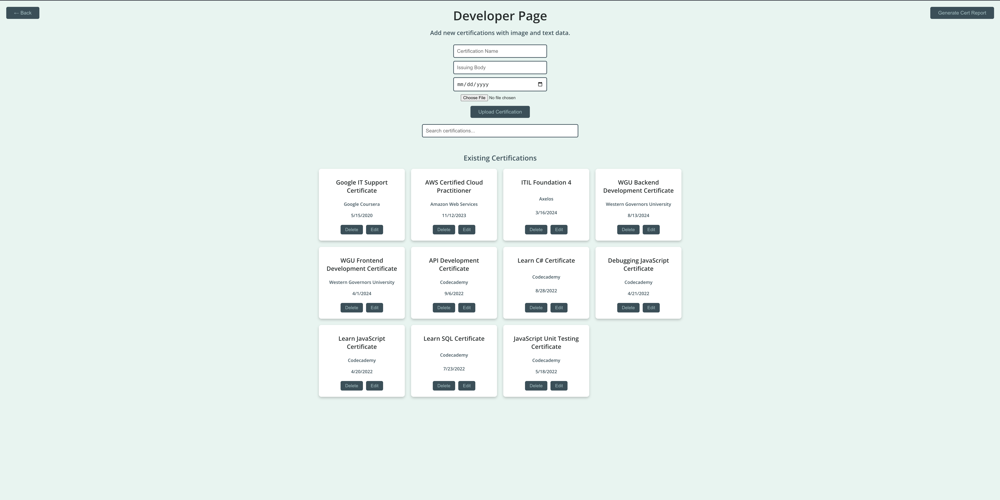

# _Portfolio Page_

#### By _**Sean Keane**_

#### Just interested in checking out my website?  Go to [sean-keane.com](https://sean-keane.com)!

#### Portfolio Page Capstone - Epicodus Code Review 09/20/2024

## Technologies Used

* HTML
* SCSS
* JavaScript
* React
* C#
* SQL
* NPM
* Jest
* ESLint
* Webpack

## Packages Utilized

* EmailJS
* Fortawesome
* MUI Carousel
* Animate CSS
* Toastify

## Description
I created this full-stack portfolio application for my B.S. in Software Engineering.  The project comprises three distinct parts: a React front end, a C# back end, and a MySQL database.  The development of this app helped me grow in many areas as a software engineer, from networking/hosting to project management.  

While the end user will enjoy the simplicity of my single-page app, I'm proud of the scalability and forethought put into this project.  I created a developer page with authentication that allows full CRUD functionality of the populated certification data stored on the MySQL database.  The developer page functionality will enable me to upload new certifications and quickly edit and delete old ones.  In addition, I developed a search functionality for the developer page and a generate reports button to get certification data off the website rapidly.

Developing this application helped me expand my understanding of React, C#, MySQL, new dependencies, hosting, documentation, and software solutions.


## Setup/Installation Requirements

1) Clone this repository to your desktop.
2) Navigate to the now installed directory and open in your editor of choice.
3) Setup the database:
      * Ensure MySQL is running on port `3306`
      * Login to MySQL with: `mysql -u root -p`
      * Create the database with the command: `CREATE DATABASE PortfolioCerts;`
                                              `EXIT;`
4) Navigate to the backend with: `cd portfolio-page-backend`.
5) Update the appsettings.json with your MySQL credentials and authentication details:
```json
   "ConnectionStrings": {
     "DefaultConnection": "Server=localhost;Database=PortfolioCerts;User=<your_mysql_username>;Password=<your_mysql_password>;"
   },
   "Authentication": {
     "Username": "<your_admin_username>",
     "Password": "<your_admin_password>"
   } 
```
6) Apply the migrations to setup the database schema: `dotnet restore`
                                                      `dotnet ef database update`
* Note: If dotnet ef is not recognized install it with the command: `dotnet tool install --global dotnet-ef`
7) Run and build the backend with the commands: `dotnet build`
                                                `dotnet run`
8) Navigate to the Frontend with `cd ../portfolio-page`
9) Install frontend dependencies with `npm install`
10) Start the react application with `npm start`
11) You now should have three seperate pieces of software running:
* MySQL, 
* C# Backend
* React Frontend
12) Access the application: 
* Database: Local instance on port: `3306`
* Backend: `https://localhost:5001/swagger/index.html`
* Frontend:`http://localhost:3000/`

## For a visual representation of setup and a successfully built application, please consult the attached gif.

## Site Example


## Developer Page



## Known Bugs

* No known bugs


## License

If you have any questions or concerns feel free to contact me at code@sean-keane.com

*This is licensed under the MIT license*

Copyright (c) 09-20-2024 **_Sean Keane_**

